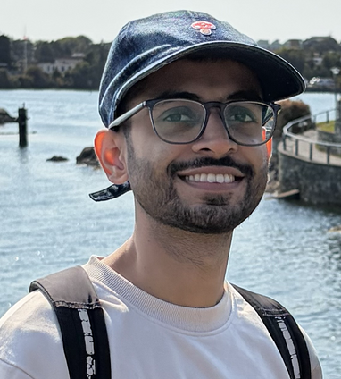

{width=250px}

I am a mechanical engineering graduate from India, and before joining the MDS program, I worked as a software developer at Dassault Systèmes for over three years. My work primarily involved C++ development and designing algorithms for engineering software. I joined the MDS program to build a strong foundation in data science and to learn how to apply these skills to real-world problems.

